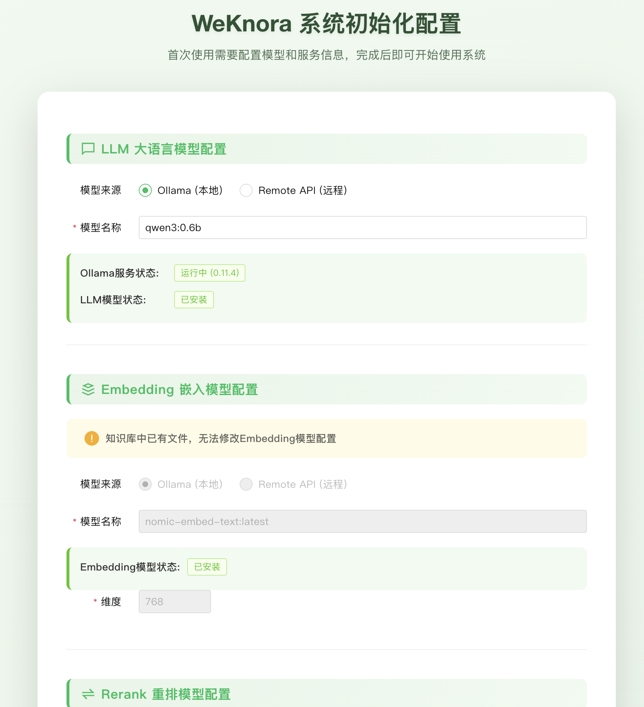
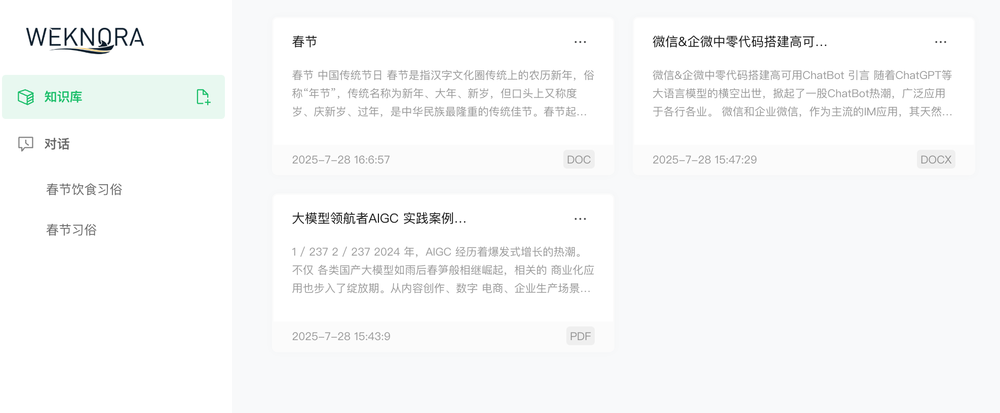
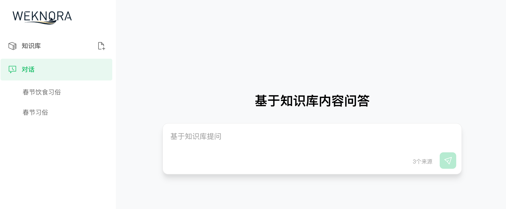

<p align="center">
  <picture>
    
  </picture>
</p>

<p align="center">
    <a href="https://weknora.weixin.qq.com" target="_blank">
        
    </a>
    <a href="https://chatbot.weixin.qq.com" target="_blank">
        
    </a>
    <a href="https://github.com/Tencent/WeKnora/blob/main/LICENSE">
        
    </a>
    <a href="./CHANGELOG.md">
        
    </a>
</p>

<p align="center">
| <a href="./README.md"><b>English</b></a> | <a href="./README_CN.md"><b>简体中文</b></a> | <b>日本語</b> |
</p>

<p align="center">
  <h4 align="center">

  [プロジェクト紹介](#-プロジェクト紹介) • [アーキテクチャ設計](#️-アーキテクチャ設計) • [コア機能](#-コア機能) • [クイックスタート](#-クイックスタート) • [ドキュメント](#-ドキュメント) • [開発ガイド](#-開発ガイド)

  </h4>
</p>

# 💡 WeKnora - 大規模言語モデルベースの文書理解検索フレームワーク

## 📌 プロジェクト紹介

[**WeKnora（ウィーノラ）**](https://weknora.weixin.qq.com) は、大規模言語モデル（LLM）をベースとした文書理解と意味検索フレームワークで、構造が複雑で内容が異質な文書シナリオ向けに特別に設計されています。

フレームワークはモジュラーアーキテクチャを採用し、マルチモーダル前処理、意味ベクトルインデックス、インテリジェント検索、大規模モデル生成推論を統合して、効率的で制御可能な文書Q&Aワークフローを構築します。コア検索プロセスは **RAG（Retrieval-Augmented Generation）** メカニズムに基づいており、文脈関連フラグメントと言語モデルを組み合わせて、より高品質な意味的回答を実現します。

**公式サイト：** https://weknora.weixin.qq.com

## 🔒 セキュリティ通知

**重要：** v0.1.3バージョンより、WeKnoraにはシステムセキュリティを強化するためのログイン認証機能が含まれています。本番環境でのデプロイメントにおいて、以下を強く推奨します：

- WeKnoraサービスはパブリックインターネットではなく、内部/プライベートネットワーク環境にデプロイしてください
- 重要な情報漏洩を防ぐため、サービスを直接パブリックネットワークに公開することは避けてください
- デプロイメント環境に適切なファイアウォールルールとアクセス制御を設定してください
- セキュリティパッチと改善のため、定期的に最新バージョンに更新してください

## 🏗️ アーキテクチャ設計


WeKnoraは現代的なモジュラー設計を採用し、完全な文書理解と検索パイプラインを構築しています。システムには主に文書解析、ベクトル化処理、検索エンジン、大規模モデル推論などのコアモジュールが含まれ、各コンポーネントは柔軟に設定および拡張できます。

## 🎯 コア機能

- **🔍 正確な理解**：PDF、Word、画像などの文書の構造化コンテンツ抽出をサポートし、統一された意味ビューを構築
- **🧠 インテリジェント推論**：大規模言語モデルを活用して文書コンテキストとユーザーの意図を理解し、正確なQ&Aとマルチターン対話をサポート
- **🔧 柔軟な拡張**：解析、埋め込み、検索から生成までの全プロセスを分離し、柔軟な統合とカスタマイズ拡張を容易に
- **⚡ 効率的な検索**：複数の検索戦略のハイブリッド：キーワード、ベクトル、ナレッジグラフ
- **🎯 使いやすさ**：直感的なWebインターフェースと標準API、技術的な障壁なしで素早く開始可能
- **🔒 セキュアで制御可能**：ローカルおよびプライベートクラウドデプロイメントをサポート、データは完全に自己管理可能

## 📊 適用シナリオ

| 応用シナリオ | 具体的な応用 | コア価値 |
|---------|----------|----------|
| **企業ナレッジ管理** | 内部文書検索、規則Q&A、操作マニュアル照会 | ナレッジ検索効率の向上、トレーニングコストの削減 |
| **科学研究文献分析** | 論文検索、研究レポート分析、学術資料整理 | 文献調査の加速、研究意思決定の支援 |
| **製品技術サポート** | 製品マニュアルQ&A、技術文書検索、トラブルシューティング | カスタマーサービス品質の向上、技術サポート負担の軽減 |
| **法的コンプライアンス審査** | 契約条項検索、法規政策照会、ケース分析 | コンプライアンス効率の向上、法的リスクの削減 |
| **医療知識支援** | 医学文献検索、診療ガイドライン照会、症例分析 | 臨床意思決定の支援、診療品質の向上 |

## 🧩 機能モジュール能力

| 機能モジュール | サポート状況 | 説明 |
|---------|---------|------|
| 文書フォーマットサポート | ✅ PDF / Word / Txt / Markdown / 画像（OCR / Caption含む） | 様々な構造化・非構造化文書コンテンツの解析をサポート、図文混在と画像文字抽出をサポート |
| 埋め込みモデルサポート | ✅ ローカルモデル、BGE / GTE API等 | カスタムembeddingモデルをサポート、ローカルデプロイとクラウドベクトル生成インターフェースに対応 |
| ベクトルデータベース接続 | ✅ PostgreSQL（pgvector）、Elasticsearch | 主流のベクトルインデックスバックエンドをサポート、柔軟な切り替えと拡張が可能、異なる検索シナリオに適応 |
| 検索メカニズム | ✅ BM25 / Dense Retrieve / GraphRAG | 密・疎検索、ナレッジグラフ強化検索など複数の戦略をサポート、検索-再ランキング-生成プロセスを自由に組み合わせ可能 |
| 大規模モデル統合 | ✅ Qwen、DeepSeek等をサポート、思考/非思考モード切り替え | ローカル大規模モデル（Ollama起動など）に接続可能、または外部APIサービスを呼び出し、推論モードの柔軟な設定をサポート |
| Q&A能力 | ✅ コンテキスト認識、マルチターン対話、プロンプトテンプレート | 複雑な意味モデリング、指示制御、チェーンQ&Aをサポート、プロンプトとコンテキストウィンドウを設定可能 |
| エンドツーエンドテストサポート | ✅ 検索+生成プロセスの可視化と指標評価 | 一体化されたリンクテストツールを提供、リコール的中率、回答カバレッジ、BLEU / ROUGE等の主流指標の評価をサポート |
| デプロイメントモード | ✅ ローカルデプロイメント / Dockerイメージをサポート | プライベート化、オフラインデプロイメント、柔軟な運用保守のニーズに対応 |
| ユーザーインターフェース | ✅ Web UI + RESTful API | インタラクティブインターフェースと標準APIインターフェースを提供、開発者とビジネスユーザーの使用習慣に適応 |

## 🚀 クイックスタート

### 🛠 環境要件

以下のツールがローカルにインストールされていることを確認してください：

* [Docker](https://www.docker.com/)
* [Docker Compose](https://docs.docker.com/compose/)
* [Git](https://git-scm.com/)

### 📦 インストール手順

#### ① コードリポジトリのクローン

```bash
# メインリポジトリをクローン
git clone https://github.com/Tencent/WeKnora.git
cd WeKnora
```

#### ② 環境変数の設定

```bash
# サンプル設定ファイルをコピー
cp .env.example .env

# .envを編集し、対応する設定情報を入力
# すべての変数の説明は.env.exampleのコメントを参照
```

#### ③ サービスの起動

```bash
# すべてのサービスを起動（Ollamaとバックエンドコンテナを含む）
./scripts/start_all.sh
# または
make start-all
```

#### ③ サービス起動の代替方法

```bash
# ollamaサービスを起動（オプション）
ollama serve > /dev/null 2>&1 &

# サービスを起動
docker compose up -d
```

#### ④ サービスの停止

```bash
./scripts/start_all.sh --stop
# または
make stop-all
```

### 🌐 サービスアクセスアドレス

起動成功後、以下のアドレスにアクセスできます：

* Web UI：`http://localhost`
* バックエンドAPI：`http://localhost:8080`
* リンクトレース（Jaeger）：`http://localhost:16686`

### 🔌 WeChat対話オープンプラットフォームの使用

WeKnoraは[WeChat対話オープンプラットフォーム](https://chatbot.weixin.qq.com)のコア技術フレームワークとして、より簡単な使用方法を提供します：

- **ノーコードデプロイメント**：知識をアップロードするだけで、WeChatエコシステムで迅速にインテリジェントQ&Aサービスをデプロイし、「即座に質問して即座に回答」の体験を実現
- **効率的な問題管理**：高頻度の問題の独立した分類管理をサポートし、豊富なデータツールを提供して、正確で信頼性が高く、メンテナンスが容易な回答を保証
- **WeChatエコシステムカバレッジ**：WeChat対話オープンプラットフォームを通じて、WeKnoraのインテリジェントQ&A能力を公式アカウント、ミニプログラムなどのWeChatシナリオにシームレスに統合し、ユーザーインタラクション体験を向上

### 🔗MCPサーバーを使用してデプロイ済みのWeKnoraにアクセス
#### 1️⃣リポジトリのクローン
```
git clone https://github.com/Tencent/WeKnora
```
#### 2️⃣MCPサーバーの設定
MCPクライアントでサーバーを設定
```json
{
  "mcpServers": {
    "weknora": {
      "args": [
        "path/to/WeKnora/mcp-server/run_server.py"
      ],
      "command": "python",
      "env":{
        "WEKNORA_API_KEY":"WeKnoraインスタンスに入り、開発者ツールを開いて、リクエストヘッダーx-api-keyを確認、skで始まる",
        "WEKNORA_BASE_URL":"http(s)://あなたのWeKnoraアドレス/api/v1"
      }
    }
  }
}
```
stdioコマンドで直接実行
```
pip install weknora-mcp-server
python -m weknora-mcp-server
```

## 🔧 初期設定ガイド

ユーザーが各種モデルを素早く設定し、試行錯誤のコストを削減するために、元の設定ファイル初期化方法を改善し、Web UIインターフェースを追加して各種モデルの設定を行えるようにしました。使用前に、コードが最新バージョンに更新されていることを確認してください。具体的な使用手順は以下の通りです：
本プロジェクトを初めて使用する場合は、①②の手順をスキップして、直接③④の手順に進んでください。

### ① サービスの停止

```bash
./scripts/start_all.sh --stop
```

### ② 既存のデータテーブルをクリア（重要なデータがない場合の推奨）

```bash
make clean-db
```

### ③ コンパイルしてサービスを起動

```bash
./scripts/start_all.sh
```

### ④ Web UIにアクセス

http://localhost

初回アクセス時は自動的に初期設定ページにリダイレクトされ、設定完了後は自動的にナレッジベースページにリダイレクトされます。ページの指示に従ってモデルの設定を完了してください。




## 📱 機能デモ

### Web UIインターフェース

<table>
  <tr>
    <td><b>ナレッジアップロード</b><br/></td>
    <td><b>ナレッジQ&Aエントリー</b><br/></td>
  </tr>
  <tr>
    <td colspan="2"><b>図文結果回答</b><br/></td>
  </tr>
</table>

**ナレッジベース管理：** 各種文書のドラッグ＆ドロップアップロードをサポートし、文書構造を自動認識してコア知識を抽出し、インデックスを構築します。システムは処理の進行状況と文書のステータスを明確に表示し、効率的なナレッジベース管理を実現します。

### 文書ナレッジグラフ

<table>
  <tr>
    <td></td>
    <td></td>
  </tr>
</table>

WeKnoraは文書をナレッジグラフに変換し、文書内の異なる段落間の関連関係を表示することをサポートします。ナレッジグラフ機能を有効にすると、システムは文書内部の意味関連ネットワークを分析・構築し、ユーザーが文書内容を理解するのを助けるだけでなく、インデックスと検索に構造化サポートを提供し、検索結果の関連性と幅を向上させます。

### 対応MCPサーバー呼び出し効果


## 📘 ドキュメント

よくある問題の解決：[よくある問題](./docs/QA.md)

詳細なAPIドキュメントは：[APIドキュメント](./docs/API.md)を参照してください

## 🧭 開発ガイド

### 📁 プロジェクトディレクトリ構造

```
WeKnora/
├── cmd/         # アプリケーションエントリー
├── internal/    # コアビジネスロジック
├── config/      # 設定ファイル
├── migrations/  # データベースマイグレーションスクリプト
├── scripts/     # 起動とツールスクリプト
├── services/    # 各サブサービスの実装
├── frontend/    # フロントエンドプロジェクト
└── docs/        # プロジェクトドキュメント
```

### 🔧 よく使うコマンド

```bash
# データベースをクリア（注意して使用！）
make clean-db
```

## 🤝 貢献ガイド

コミュニティユーザーの貢献を歓迎します！提案、バグ、新機能のリクエストがある場合は、[Issue](https://github.com/Tencent/WeKnora/issues)を通じて提出するか、直接Pull Requestを提出してください。

### 🎯 貢献方法

- 🐛 **バグ修正**: システムの欠陥を発見して修正
- ✨ **新機能**: 新しい機能を提案して実装
- 📚 **ドキュメント改善**: プロジェクトドキュメントを改善
- 🧪 **テストケース**: ユニットテストと統合テストを作成
- 🎨 **UI/UX最適化**: ユーザーインターフェースと体験を改善

### 📋 貢献フロー

1. **プロジェクトをFork** してあなたのGitHubアカウントへ
2. **機能ブランチを作成** `git checkout -b feature/amazing-feature`
3. **変更をコミット** `git commit -m 'Add amazing feature'`
4. **ブランチをプッシュ** `git push origin feature/amazing-feature`
5. **Pull Requestを作成** して変更内容を詳しく説明

### 🎨 コード規約

- [Go Code Review Comments](https://github.com/golang/go/wiki/CodeReviewComments)に従う
- `gofmt`を使用してコードをフォーマット
- 必要なユニットテストを追加
- 関連ドキュメントを更新

### 📝 コミット規約

[Conventional Commits](https://www.conventionalcommits.org/)規約を使用：

```
feat: 文書バッチアップロード機能を追加
fix: ベクトル検索精度の問題を修正
docs: APIドキュメントを更新
test: 検索エンジンテストケースを追加
refactor: 文書解析モジュールをリファクタリング
```

## 📄 ライセンス

このプロジェクトは[MIT](./LICENSE)ライセンスの下で公開されています。
このプロジェクトのコードを自由に使用、変更、配布できますが、元の著作権表示を保持する必要があります。
